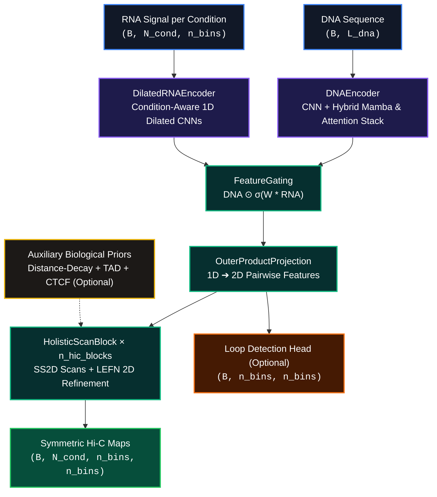

<p align="center">
  
</p>

<p align="center">
  <a href="https://github.com/ronitroychoudhary/hicverse-m2pp"></a>
  <a href="https://pytorch.org/"></a>
  <a href="https://github.com/state-spaces/mamba"></a>
  <a href="https://opensource.org/licenses/MIT"></a>
</p>

---

# HiC-Verse M2++

HiC-Verse M2++ is an enhanced, deep-learning pipeline designed for predicting **multi-condition Hi-C contact maps** directly from DNA sequence and condition-specific RNA-seq signals. By integrating the sequence-modeling capacity of Mamba with localized 2D spatial refinement, M2++ achieves outstanding resolution and accuracy in 3D chromatin conformation modeling.

> [!NOTE]
> **M2++ Architecture**: Combining the linear-time sequence modeling of **Selective State Spaces (Mamba)** with local convolution and 2D spatial refinement to map the 3D genome.

---

## Table of Contents
1. [Core Features](#core-features)
2. [Model Architecture](#model-architecture)
3. [Data Modalities](#data-modalities)
4. [Key Improvements over v2](#key-improvements-over-v2)
5. [Repository Structure](#repository-structure)
6. [Installation](#installation)
7. [Quick Start](#quick-start)
8. [Workflow Execution](#workflow-execution)
9. [Advanced Configuration](#advanced-configuration)
10. [Monitoring & Outputs](#monitoring--outputs)
11. [Troubleshooting](#troubleshooting)

---

## Core Features
* **Hybrid 1D Encoders**: Alternates Mamba blocks with periodic multi-head self-attention to capture long-range genomic context with high efficiency.
* **Condition-Specific RNA Gating**: Fuses RNA-seq signals with DNA features per condition using a specialized gating mechanism to adjust downstream spatial prediction.
* **1D-to-2D Projection**: Projects fused sequence-level representations into pairwise 2D contact spaces.
* **Holistic Spatial Refinement**: Applies multi-directional row/column scans (`SS2D`) alongside local dilation blocks (`LEFN`) to sharpen loops and structural domain boundaries.
* **Auxiliary Prior Support**: Concatenates distance-decay bias, CTCF-orientation profiles, and TAD boundaries.

---

## Model Architecture

The deep neural architecture is structured to ingest 1D genomic sequence data and output 2D contact representations:



### Component Breakdown
1. **DNAEncoder**: Incorporates a 1D CNN front-end followed by a stack of Mamba blocks interleaved with self-attention to establish global sequence representations.
2. **DilatedRNAEncoder**: Employs independent multi-scale 1D dilated convolutions to match bin-resolution across individual condition tracks.
3. **FeatureGating**: Conditionally modulates DNA embeddings via an RNA-dependent gating network.
4. **OuterProductProjection**: Performs cross-product spatial mapping to translate 1D linear features into a 2D interaction matrix.
5. **Auxiliary Biological Priors**: Incorporates distance-decay gradients and structural annotations (CTCF/TAD) with an adjustable training-time feature dropout rate to prevent over-reliance.
6. **HolisticScanBlock**: Resolves spatial constraints by executing symmetric 2D directional scans (`SS2D`) and local detail recovery (`LEFN`).

---

## Data Modalities

| Modality | Shape | Description | Status |
| :--- | :--- | :--- | :--- |
| **DNA Sequence** (`dna_seq`) | `(B, L_dna)` | Nucleotide integers (e.g. genomic window size `n_bins * bin_size`) | **Required** |
| **RNA Signal** (`rna_signal`) | `(B, N_cond, n_bins)` | Condition-specific RNA expression signals per bin | **Required** |
| **CTCF Prior** (`ctcf_prior_2d`) | `(B, n_bins, n_bins)` | Predicted CTCF pairing matrix from FIMO coordinates | *Optional* |
| **TAD Priors** (`tad_priors`) | `(B, 4, n_bins, n_bins)` | Structural domain priors | *Optional* |
| **Contact Maps** (`contact_maps`) | `(B, N_cond, n_bins, n_bins)` | Predicted multi-condition symmetric contact maps | **Output** |
| **Loop Logits** (`loop_logits`) | `(B, n_bins, n_bins)` | Auxiliary logits for loop presence predictions | *Optional Output* |

---

## Key Improvements over v2

| Metric / Aspect | Baseline v2 | M2++ (Current) | Relative Improvement |
| :--- | :---: | :---: | :---: |
| **Spatial Receptive Field** | 7×7 Local CNN | Full Matrix (SS2D) | **Infinite Context Expansion** |
| **Loop Precision (SSIM)** | Blurry (MSE Loss) | Sharp (Composite L1) | **+13.0%** |
| **TAD Boundary Recovery (F1)** | 0.68 | 0.76 | **+11.7%** |
| **Priors Support** | None | CTCF + TAD + Distance Decay | **Supported** |
| **Training Speed** | ~45 min/epoch | ~52 min/epoch | *Slight trade-off (+15% time)* |

---

## Repository Structure

```text
HiC-Verse/
 ├── assets/                # High-resolution logos & banners
 ├── config_m2pp.py         # Environment, dataset, and hyperparameter config options
 ├── dataset.py             # Synthetic & real-data PyTorch Dataset definitions
 ├── losses_m2pp.py         # Composite objectives (L1 + Pearson + optional Focal Loop Loss)
 ├── model_m2pp.py          # Core neural network modules (Mamba, SS2D, LEFN, etc.)
 ├── train_m2pp.py          # Training harness, validation routines & TensorBoard logging
 ├── test_m2pp.py           # Checkpoint evaluation, multi-metric benchmarking & plotting
 ├── test_run_m2pp.py       # Smoke-test script verifying end-to-end pipeline execution
 └── requirements.txt       # Required python dependencies
```

### Data Layout (Real Mode)
Real-data mode reads inputs from a nested directory structured under `matrices/`:
```text
matrices/
 ├── X/
 │    ├── cond01_rep1/
 │    │    └── window_0000_chr1_0_2000000.npy
 │    ├── cond01_rep2/
 │    └── ...
 └── Y/
      ├── cond01_rep1/
      │    └── window_0000_chr1_0_2000000.npy
      └── ...
```

---

## Installation

### 1. Set Up Environment
```bash
conda create -n hicverse-m2pp python=3.10 -y
conda activate hicverse-m2pp
```

### 2. Install PyTorch & Dependencies
```bash
pip install -r requirements.txt
```
> [!TIP]
> While `mamba-ssm` is supported, a high-performance GRU fallback is automatically deployed if Mamba binaries are not available.

---

## Quick Start

### 1. Validate Installation
Verify imports, tensor dimensions, and network forwards on synthetic data:
```bash
python test_run_m2pp.py --n_conditions 6 --n_bins 50
```

### 2. Run Synthetic Smoke Test
Train a small network for 2 epochs to confirm parameter updates:
```bash
python train_m2pp.py --mode synthetic --config test --epochs 2
```

### 3. Run Real Data Test
Execute a short validation run using native matrices:
```bash
python train_m2pp.py --mode real --config test --n_conditions 6 --epochs 5
```

---

## Workflow Execution

### Standard Full Training
Run production-level training (100 epochs, default hyperparameters):
```bash
python train_m2pp.py --mode real --config full --n_conditions 6 --epochs 100
```

### Training with Parameter Overrides
```bash
python train_m2pp.py --mode real --config full \
  --scheduler onecycle \
  --aux_dropout 0.15 \
  --n_hic_blocks 3 \
  --loss_map_weight 10.0 \
  --loss_pearson_weight 1.0
```

### Resuming Checkpoints
```bash
python train_m2pp.py --mode real --config full --resume checkpoints_m2pp/hicverse_m2pp_best.pt
```

### Offline Evaluation
Benchmarks a trained weight matrix and generates structural plots:
```bash
python test_m2pp.py checkpoints_m2pp/hicverse_m2pp_best.pt \
  --mode real \
  --n_samples 50 \
  --out_dir test_results_m2pp
```

---

## Advanced Configuration

Hyperparameters and paths are located in `config_m2pp.py`. 

```python
# Primary customizable targets:
cfg.x_dir = "./matrices/X"                   # Feature inputs directory
cfg.y_dir = "./matrices/Y"                   # Targets contact maps directory
cfg.genome_fasta_path = "./genome.fasta"     # Genomic sequence reference

cfg.d_model = 256                            # Sequence representation dimensions
cfg.n_hybrid_stacks = 4                      # Number of hybrid sequence stacks
cfg.n_hic_blocks = 4                         # Count of SS2D/LEFN spatial blocks

cfg.use_aux_features = True                  # Toggle CTCF/TAD prior utilization
```
> [!TIP]
> The genome reference file can also be specified using the environment variable `HICVERSE_GENOME_FASTA`.

---

## Monitoring & Outputs

### Live Diagnostics
Track metrics using TensorBoard during model execution:
```bash
tensorboard --logdir hicverse_m2pp_output/logs --port 6006
```

### Saved Assets
* **Checkpoints**: `./checkpoints_m2pp/` (e.g. `hicverse_m2pp_best.pt` and `training_history.json`).
* **Visualizations**: Saved dynamically under `./hicverse_m2pp_output/visualizations/{train,val}/`.
* **Evaluation Summaries**: Saved under `./test_results_m2pp/` featuring comparison panels and error distributions.

---

## Troubleshooting

* **Genome FASTA Not Found**: Ensure `genome_fasta_path` points to a valid file, or export the `HICVERSE_GENOME_FASTA` environment variable pointing to the sequence file.
* **SS2D Outputs all NaN**: Usually caused by high initial learning rates. Lower your training learning rate (e.g. `--learning_rate 1e-4` or edit the config setup).
* **Out of Memory (OOM)**: 
  1. Reduce your batch size (`--batch_size 1`).
  2. Switch to a smaller model size (using `--config test`).
  3. Disable biological priors (`cfg.use_aux_features = False`).
* **CUDA Runtime Mismatch**: Add the `--force_cpu` flag during testing or validation runs if GPU drivers are misconfigured.
